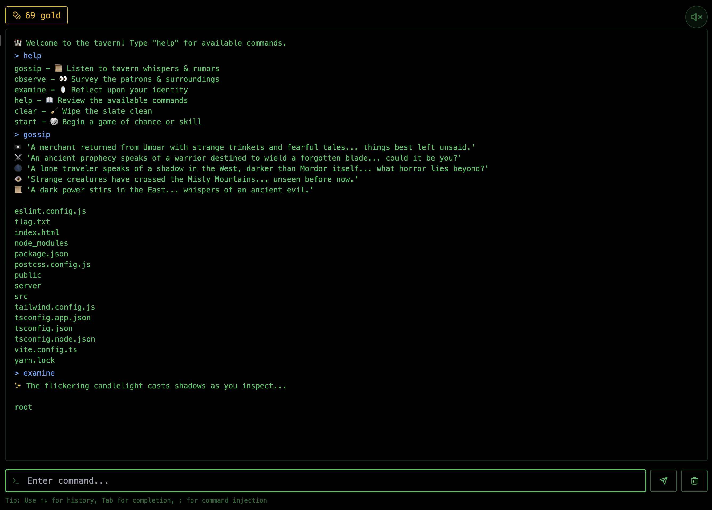
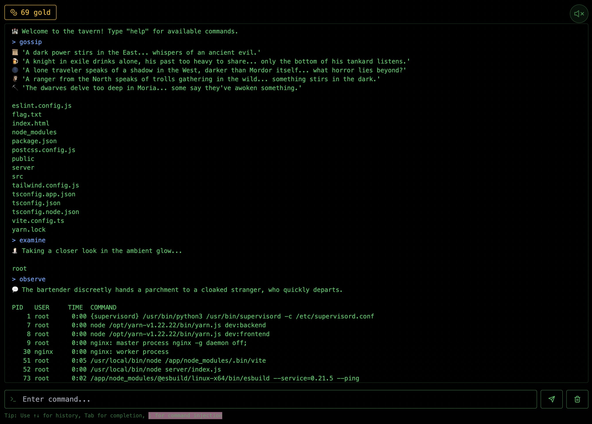
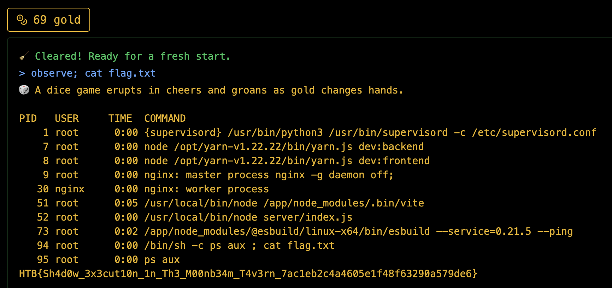

# Whispers of the Moonbeam - Web Challenge (Very Easy)

## Overview
Whispers of the Moonbeam is a straightforward web challenge showcasing command injection vulnerabilities. Simple premise, but a great intro to breaking poorly secured system commands.

## Required Knowledge
- Basic Linux commands

## What You’ll Learn
- Identifying and exploiting command injection vulnerabilities

---

## Initial Recon
Landing on the site, we’re greeted by a terminal-style interface that takes user commands.



Testing a few inputs, we find that commands like `gossip`, `observe`, and `examine` return system-like outputs, meaning they’re likely executing Linux commands in the backend. 



One line stands out—a hint suggesting we try using `;` to chain commands. That’s practically an invitation to inject commands.

---

## Finding the Vulnerability
Since we suspect system commands are being executed directly, we test some injection payloads:

### Failed Attempts
1. **Basic Command Execution**
   - Tried `observe; whoami` → No output, likely filtered.
   - Attempted `observe && ls` → Same result, so logical operators might be restricted.

2. **Bypassing Filters**
   - `observe; echo test` → No output.
   - `observe; ls -la` → No response, possibly blocking `ls`.

3. **Encoding and Obfuscation**
   - `observe; cat$IFSflag.txt` → Didn't work, so `$IFS` might be filtered.
   - `observe; $(cat flag.txt)` → No output, maybe `$()` is blocked.
   - `observe; cat\ flag.txt` → No luck, escaping the space didn't help.

At this point, it seems like certain commands are filtered, but not all. Time to find what works.

---

## Exploiting Command Injection
Running `gossip` reveals that `flag.txt` exists. Now, we just need to read it.

Using `observe; cat flag.txt`, we successfully dump the flag:

```sh
observe; cat flag.txt
```

And just like that, we have the flag! 🏴



---

## Takeaways
- **Command injection can be hinted at by unexpected system-like responses.**
- **Always test multiple injection techniques—some commands might be filtered, while others slip through.**
- **Encoding tricks like `$IFS`, `$(cmd)`, and escaping characters may help bypass filters, but they're not always foolproof.**
- **Pay attention to hints and error messages—they often guide the attack.**

Another web challenge conquered. On to the next! 🚀

